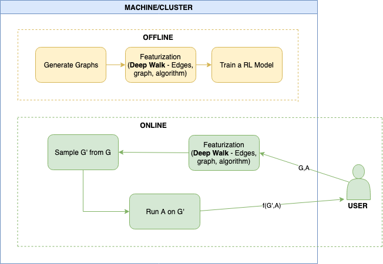

# GROUP2 - CS744 - APPROXIMATE GRAPH ANALYTICS USING REINFORCEMENT LEARNING
## Architecture

We perform approximate graph analytics using reinforcement learning that takes as input a graph and generates a sampled graph that produces almost the same results on the graph-processing algorithm as the the original graph. The reinforcement learner takes an input graph and removes one edge at a time until we get a sampled graph. We have implemented two reinforcement learners:
1. A3C algorithm
2. Vanilla RL

We perform training on the graph embeddings in the Featurization/ directory with the training parameters provided as arguments when executing the RL algorithm. The RL is then executed upon some other embedding graph file which produces a sampled graph.

- Featurization: contains the various python notebook files used for the dataset generation and featurization
- a3c-rl: contains a3c implementation for graph sampling
- vanilla-rl: our vanilla RL implementation
- gym-sampler: OpenAI gym env for comparing RL algorithms
